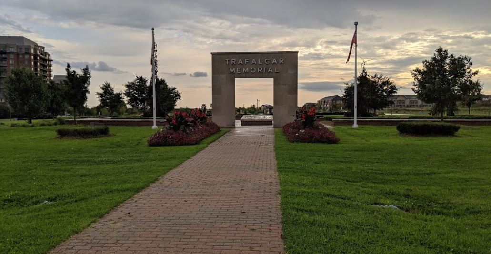

奥克维尔中心，在Dundas和Trafalgar的交汇处。该社区在功能设计综合考虑了生活，工作和娱乐等许多新的城市化要素。 位于Upper Middle路和八号线拐角处的奥克维尔购物中心还有50多家商店，餐厅和专业服务。 熙熙攘攘的人群和蓬勃发展的经济使Uptown Core看起来更像是大城市社区，而不是郊区， 也吸引那些喜欢城市生活且人口不算太多家庭。

### 交通

南北向的Trafalgar Rd 和东西向的 Dundas St是贯穿奥克维尔市内的两条主要大路 ，经由这两条主干道前往Hwy403和QEW都很方便。除了高速与主路以外，在这里搭乘公共交通也是非常方便的，在Trafalgar Rd 和 Dundas St 交界处有Uptown Core Terminal公交总站。

### 休闲

附近的商店，餐馆和健身俱乐部都在步行距离之内。附近美丽的保护区内有许多出色的远足径。社区内的绿色空间通过小径相连，包括纪念公园，市中心广场，还有两个通过钢桥连接的池塘和Windfeld Parkette公园。

### 房屋特点

上城核心区是一个高密度社区，其主要街道有现代的堆叠式联排别墅，是奥克维尔住房市场中可负担性最好的。特拉法加纪念公园（Trafalgar Memorial Park）周围以及沿通往该街区的主要干道入口点都有一栋低层和中层公寓大楼。大多数公寓房有1卧室和2卧室，价格合理；内街两旁则排列着维多利亚时代和都铎风格的联排别墅，这些房屋大多数为3间卧室，并设有一个可俯瞰街道的迷人前廊或第二层阳台。为了向新的都市主义致敬，在这些房屋的的车库位于房屋的后部，这使得社区显得更加人性化。

另外，房屋的自住率较高，出租比例只略高于10%，比整个奥克维尔的平均比例低出不少。因此社区人口流动性较低，给社区安全提供了一定的保障。

### 教育资源

- POST’S CORNERS 小学（JK - GR08）
- MUNN'S双语小学（GR01 - GR08）
- SUNNINGDALE学校（GR01 - GR08）
- FALGARWOOD学校（GR06-Gr08）
- IROQUOIS RIDGE双语高中（GR09-GR12）
- White Oaks 高中（GR09-GR12）

住在Uptown Core社区Trafalgar Rd以西，您的孩子能进入White Oaks高中求学，这所高中近些年的成绩都颇为不俗。住在Uptown Core社区Trafalgar Rd以东，学生可以入学奥克维尔享有盛名的双语高中——Iroquois Ridge High School。学校地处Glenashton Dr，配套设施非常齐全，有大型健身馆、伴有400米跑道的足球场，图书馆、餐厅、电脑室能基础设施当然就更不用说了。

### 综合评价

对于年轻专业人士，夫妇和家庭，该社区是一个绝佳选择。
