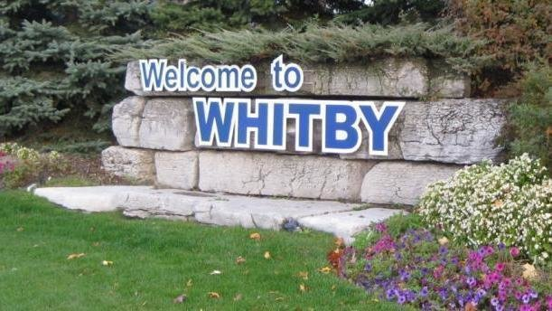
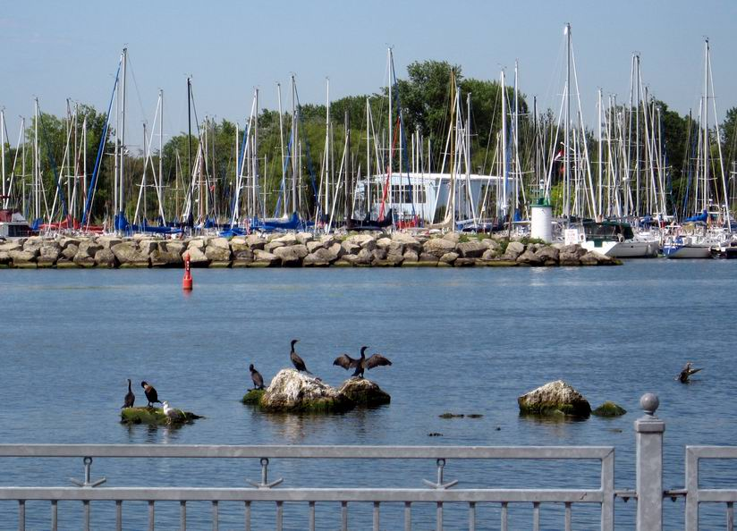

惠特比镇是Dunham地区的总部。居住在惠特比（Whitby）的人口约为14万。

许多当地居民受雇于加拿大Sony公司，Enbridge公司，加拿大诺华制药公司（Novartis Pharmaceuticals）和Woodbridge泡沫公司等公司，这些公司都设在惠特比。

Whitby当地社区配套设施相当完善，除了各个社区文化中心以外，还拥有3个大型体育休闲中心。其中Iroquois Park Sports Center 拥有6个冰球场、6个网球场、5个棒球场、2个室内游泳池，以及足球场，专用滑板场地和美食广场等，这里可以称得上是加拿大最大的地方政府运营的休闲中心。Whitby还拥有9个高尔夫球场、120个公园。最大的特色就是毗邻安大略湖，拥有420个泊位的游艇码头，和游艇俱乐部等配套设施。这对喜欢水上休闲运动的富豪人士来说，具有相当大的诱惑力。

Whitby 教育资源丰富，有从小学到高中的30多所公立学校， 并且拥有3所高等教育机构：Durham College, UOIT(安大略理工大学)， Intenational College of Natural Health and Traditional Chinese Madicine, 提供包括食品， 商科，健康， 科学方面的学位和技能培训。

Whitby拥有精心设计和负担得起的新住宅区，前往多伦多的便捷交通，美丽的湖滨，备受好评的学校，繁华的市中心购物区以及出色的娱乐设施。近年来，吸引了越来越多的家庭选择在Whity置业。
